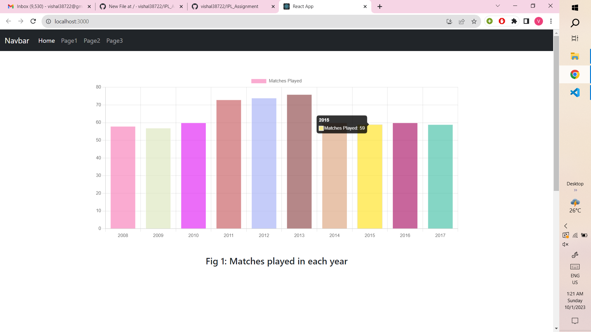
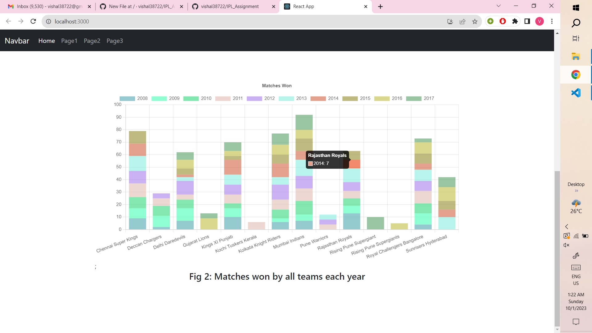
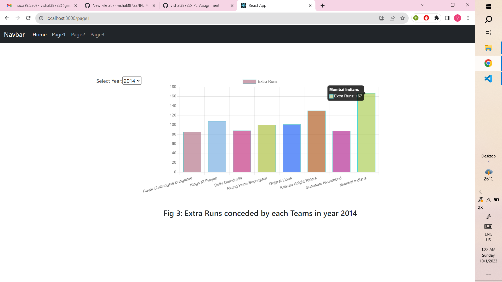
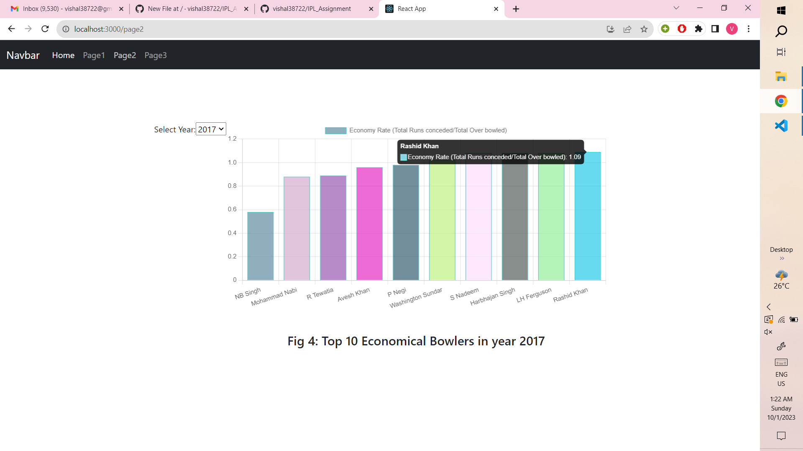
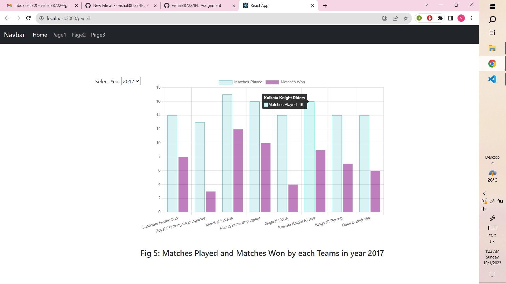

# IPL Assignment
(https://img.shields.io/badge/React-20232A?style=for-the-badge&logo=react&logoColor=61DAFB)
(https://img.shields.io/badge/Node.js-43853D?style=for-the-badge&logo=node.js&logoColor=white)
(https://img.shields.io/badge/MongoDB-4EA94B?style=for-the-badge&logo=mongodb&logoColor=white)
(https://img.shields.io/badge/Chartjs-4EA94B?style=for-the-badge&logo=chartjs&logoColor=white)


backend --> contains source code for server  

frontend --> contains source code for User Interface  

screenshots --> contains screenshots of the webpages  

problem.txt --> contains problems faced by me during this project and their solutions (stackoverflow link) 


## Getting Started

*clone this repo using this command ```git clone https://github.com/vishal38722/IPL_Assignment.git```*

### Installation

*from root directory go to frontend directory using this command*  
                ```cd frontend```  
*run this command to install node modules*  
                ```npm install```  
*from root directory go to backend directory using this command*  
                ```cd backend```  
*run this command to install node modules*  
                ```npm install```

### Run the Project
In frontend and backend directories run this command to run the project  
                ```npm run start``` (in both directories frontend and backend)

### About the Project
In this project 5 charts are drawn based on IPL [Dataset](https://www.kaggle.com/datasets/manasgarg/ipl) taken from kaggle  

This dataset contains details about the matches played from 2008-17.

In this Project, desription of the 5 charts drawn are as follows:

1. Plot the number of matches played per year of all the years in IPL. (Landing page Ist graph)
2. Plot a stacked bar chart of matches won of all teams over all the years of IPL. (Landing page IInd graph)
3. For the year "YYYY" plot the extra runs conceded per team. 
4. For the year "YYYY" plot the top economical bowlers.
5. For the year "YYYY" plot a chart for matches played vs matches won for each team.

#### Chart 1


#### Chart 2


#### Chart 3


#### Chart 4


#### Chart 5


